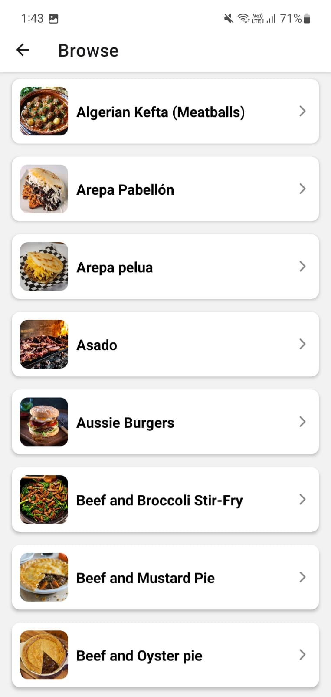
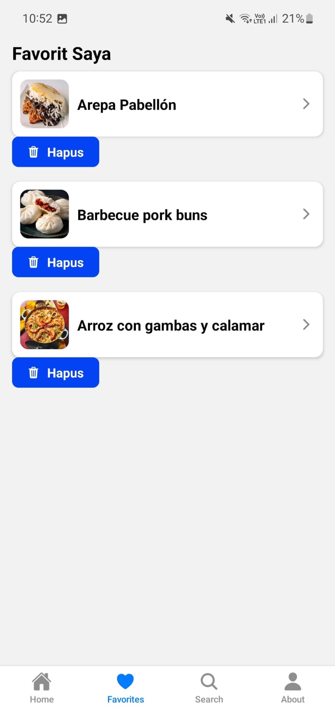
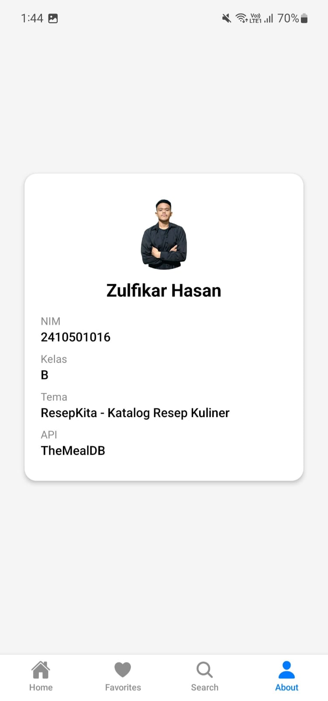

### ResepKita 

## Informasi Mahasiswa
- **Nama** : Zulfikar Hasan  
- **NIM** : 2410501016  
- **Kelas** : B  

---

## Tema 
Tema yang dipilih: A - ResepKita - Katalog Resep Kuliner

Aplikasi ini digunakan untuk melihat kategori makanan, menelusuri resep berdasarkan kategori, melihat detail resep, mencari resep berdasarkan nama, serta menyimpan resep favorit.

---

## Tech Stack

- React Native (Expo)
- JavaScript
- React Navigation
- Axios

 ## Dependencies utama (dari package.json):

- react: ^18.x
- react-native: ^0.7x
- expo: ~xx.x.x
- @react-navigation/native
- @react-navigation/bottom-tabs
- @react-navigation/native-stack
- axios

---

## Cara Menjalankan

Aplikasi ini menggunakan **Expo**.

### 1. Clone Repository
```bash
git clone <URL_REPOSITORY>
```

### 2. Masuk Ke Folder Project
```bash
cd ResepKita
```

### 3. Install Dependencies
```bash
npm install
```

### 4. Jalankan Aplikasi
```bash
npx expo start
```

---
## Screenshot Preview

<p>
  
  
  
  
  
  
</p>

## Video Demo
Link demo aplikasi:
https://your-video-link.com

---

## State Management
Aplikasi ini menggunakan Context API + useReducer untuk mengelola state global, khususnya fitur Favorites.

Alasan memakai Context API + useReducer, karena:
- Lebih sederhana dibanding Redux
- Cukup untuk skala aplikasi kecil-menengah
- Tidak perlu dependency tambahan
- Mudah dipahami dan diimplementasikan

---

## Daftar Referensi
- https://reactnavigation.org/docs/stack-navigator
- https://reactnavigation.org/docs/bottom-tab-navigator
- https://reactnavigation.org/docs/params
- https://react.dev/reference/react/useContext
- https://react.dev/reference/react/useReducer
- https://axios-http.com/docs/intro
- https://www.themealdb.com/api.php
- https://react.dev/learn/sharing-state-between-components

---

## Refleksi Pengerjaan

Dalam proses pengerjaan aplikasi ResepKita, ada beberapa tantangan yang membingungkan, terutama dalam memahami alur data dari API dan integrasi antar screen. Salah satu kesulitannya itu saat menghubungkan data dari kategori ke detail resep, karena API yang digunain tidak langsung menyediakan data detail dari kategori, jadi perlu dilakukan dua kali request. Selain itu, bug yang sempat muncul itu data tidak tampil di DetailScreen karena kesalahan dalam mengirim parameter navigation. Hal ini membuat aplikasi menampilkan error "Gagal memuat data". Tapi setelah dilakukan debugging, ternyata masalahnya terletak pada perbedaan parameter antara category dan idMeal. Dalam implementasi state management, awalnya terjadi kesalahan karena data yang disimpan ke favorit adalah kategori, bukan meal. Hal ini membuat tampilan favorit tidak sesuai. Setelah diperbaiki dengan memastikan hanya data meal yang disimpan, fitur favorit dapat berjalan dengan baik. Dari pengerjaan ini, saya mempelajari pentingnya konsistensi struktur data, pemahaman flow aplikasi, serta bagaimana mengelola state global menggunakan Context API dan useReducer. 
